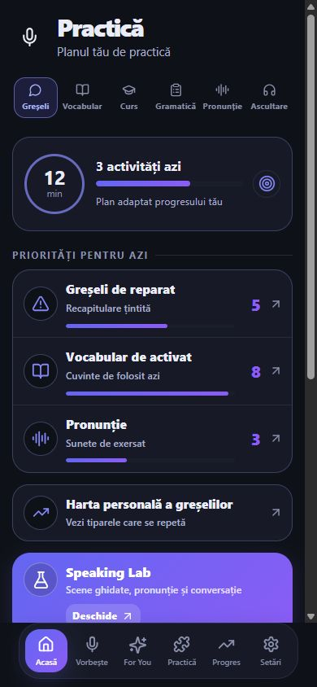
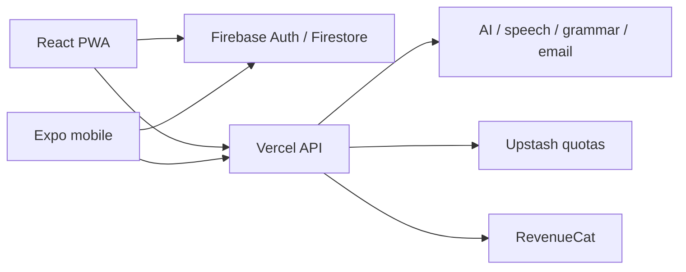

# EnglezaAI

English learning for Romanian speakers through AI voice conversations, targeted practice and a shared web/mobile learning engine.

**Try the live application: [englezaai.com](https://englezaai.com)**  
Created by [Cosmin Popescu](https://github.com/popescucosmin13).

This repository presents the React PWA, Expo mobile application and Vercel API implementation. The live product is available at the link above; running this source requires your own development services and credentials.

## Features

- Voice conversations with Romanian explanations, correction modes and hands-free controls.
- English Mirror: correct, natural and professional reformulations.
- Mistake history, active vocabulary practice and spaced repetition.
- Level assessment, grammar, pronunciation, listening and adaptive microlearning.
- Progress reports, reminders and personalized practice.
- Firebase authentication and cloud persistence; RevenueCat mobile subscriptions.

## Preview



## Technology

| Layer | Stack |
| --- | --- |
| Web | React 18, TypeScript 5.6, Vite 5, React Router, PWA |
| Mobile | Expo 57, React Native 0.86, React 19, TypeScript 6, Expo Router |
| API | TypeScript Vercel functions, Firebase Admin |
| Data | Firebase Auth, Firestore, platform storage |
| Integrations | OpenRouter, speech providers, LanguageTool, Mailjet, Upstash, RevenueCat |
| Tests | Vitest |

## Architecture



The shared-file manifest checks 60 files between web and mobile before the build. UI, navigation, audio and storage adapt to each platform. See [Architecture](docs/ARCHITECTURE.md) and [Project overview](docs/PROJECT_OVERVIEW.md).

## Run locally

Use Node.js 22.12+ and npm. Install web and mobile dependencies separately:

```bash
npm ci
npm --prefix mobile ci
```

Copy each `.env.example` to a sibling `.env` and configure your own Firebase project and providers. Server secrets must never use `VITE_` or `EXPO_PUBLIC_` prefixes.

```bash
npm run dev           # Web UI: http://localhost:5199
npm run dev:vercel    # Web + API: use the URL printed by Vercel
npm --prefix mobile start
```

Vite alone serves the frontend. Connected learning features need the API and configured external services. A physical mobile device needs a reachable backend URL. Native purchases need a native build and your own store setup.

## Development configuration

- Web Firebase: `VITE_FIREBASE_*`; mobile Firebase: `EXPO_PUBLIC_FIREBASE_*`.
- Server identity: `FIREBASE_PROJECT_ID`, `FIREBASE_CLIENT_EMAIL`, `FIREBASE_PRIVATE_KEY`.
- AI and speech: `OPENROUTER_API_KEY`, `GOOGLE_AI_API_KEY`, `AZURE_SPEECH_*`, optional `TTS_*`.
- Backend/mobile URL: `APP_URL` and `EXPO_PUBLIC_API_BASE`; set your `GRAMMAR_SERVICE_URL`.
- Email, quotas and subscriptions: `MAILJET_*`, `UPSTASH_REDIS_REST_*`, `REVENUECAT_*`.

Templates contain the complete variable list. This copy uses demo admin/review UIDs, example support contacts and development URLs. Replace demo UIDs consistently in server access policy, client role lists, tests and Firestore rules before deploying your instance. Configure authentication and deploy rules to your own Firebase project.

Mobile uses `com.example.englezaai` identifiers and has no Expo owner/project or store submission linkage. Choose unique IDs, initialize your own EAS project and configure your SDK keys. Update store destinations, legal pages and support contacts for your own instance.

## Checks and build

```bash
npm run sync:check
npm test
npm --prefix mobile test
npx tsc --noEmit
npm --prefix mobile run typecheck
npm run build
npm run preview
```

The web build requires the four Firebase client variables listed in `vite.config.ts`. Preview serves the frontend without server functions. Root test scripts select web/API tests; mobile tests run separately. See [Development](docs/DEVELOPMENT.md).

## Repository structure

```text
src/                 Web UI and learning engine
api/                 Server handlers and integration helpers
mobile/src/          Mobile routes, UI and shared learning engine
mobile/assets/       Icons, images and curriculum
mobile/plugins/      Expo configuration plugins
microlearning/       Web curriculum
public/              PWA, fonts and public pages
scripts/             Shared-code checks and build support
docs/                Public architecture, development and screenshots
```

## Security and licensing

The source export contains no Git history, local environment files, signing credentials or internal release guides. See [Security](docs/SECURITY.md) for development practices. Source publication does not establish that a deployed service has no vulnerabilities.

No project-wide open-source license has been selected. Existing third-party notices remain in `mobile/LICENSE` and `public/fonts/`; see [Third-party notices](THIRD_PARTY_NOTICES.md).
