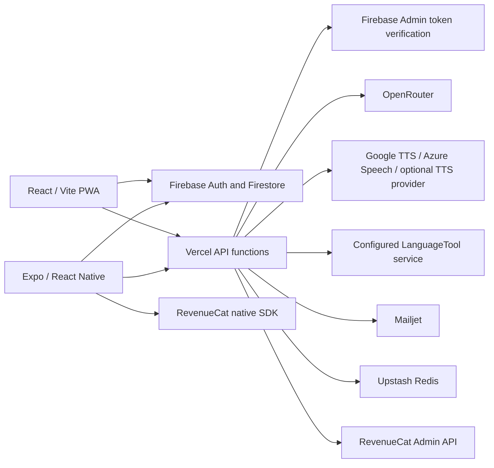

# Architecture

## Entry points and build

Web starts at `index.html` → `src/main.tsx` → `src/App.tsx`. Authentication and access providers wrap a HashRouter. `/auth-action` handles Firebase email action links outside the app shell.

Mobile starts with `expo-router/entry`; routes live under `mobile/src/app/`, with bootstrap and providers in `_layout.tsx`.

Vercel request handlers live in `api/`; helpers in `api/_lib/`. `vercel.json` declares Vite, the email-action rewrite and function duration. `.vercelignore` excludes API tests from deployment.

## Learning loop

`useVoiceChat` coordinates recording, transcription, tutor messages, audio playback and feedback. `useHandsFree` supplies platform-specific hands-free handling. Educational logic lives in `logic/`, `srs/`, `grammar/`, `foryou/` and `microlearning/`. `db/db.ts` persists profile, activity and learning records.

Web imports `microlearning/microlectii_toate.json`; mobile imports `mobile/assets/data/microlectii_toate.json`. Both datasets must be in a source distribution.

## Shared code

`scripts/shared-files.json` lists 60 files that must match between `src/` and `mobile/src/`. The sync script's `check` is read-only. Copy commands are deliberate developer actions. UI, Firebase initialization, storage, audio, API base URLs and navigation are adapted separately.

## Trust boundaries

Firebase client configuration and RevenueCat SDK keys are client identifiers. Provider keys, Firebase Admin private keys and RevenueCat Admin keys belong only on the server. API handlers verify identity, apply access checks, model policy and quotas. Firestore authorization lives in `firestore.rules`.

These controls depend on deployment configuration. The presence of code does not mean subscription enforcement or distributed limits are enabled. Memory counters do not provide cross-instance accounting.
